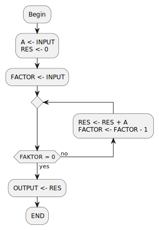

# Easy Multiplier

## Task

The goal is to design a simple multiplier for two integer, positive fixed point numbers.
The two factors are to be read in via one input. The result is to be
output via one output. Both factors must not be greater than 255.

## Flowchart

The following flowchart should illustrate the idea of the solution. `FACTOR` and `A` are the two factors that are read from the input. `RES` is the result register.



## Draft Program

Open the RTeasy-Online IDE. At startup you are automatically in editing mode. If there is already code, it must be removed first.

Now the following program code can be entered into the editor. The flowchart has already shown that the registers `A`, `FACTOR` and `RES` are needed. Since the factors are maximum 255, two 8-bit registers, as well as a 16-bit result register are sufficient:

```rteasy
declare register A(7:0), FACTOR(7:0), RES(15:0)
```

For the input and the output of the program one input and one output are needed, where the input has the size of the factors (8-bit) and the output has the size of the result (16-bit):

```rteasy
~declare register A(7:0), FACTOR(7:0), RES(15:0)
declare input IN(7:0)
declare output OUT(15:0)
```

The program starts ideally with the initialization of the registers, whereby the label `BEGIN` is only given here for the sake of clarity. Here in the first cycle the value for `A` and then in the second cycle the value for `FACTOR` is read in via the input `IN`:

```rteasy
~declare register A(7:0), FACTOR(7:0), RES(15:0)
~declare input IN(7:0)
~declare output OUT(15:0)
~
BEGIN:
A <- IN, RES <- 0;
FACTOR <- IN;
```

A loop follows which checks whether the value in `FACTOR` is zero. If yes, the result is written to `OUT`, if not, `FACTOR` is decremented and the value from `A` is added to `RES`:

```rteasy
~declare register A(7:0), FACTOR(7:0), RES(15:0)
~declare input IN(7:0)
~declare output OUT(15:0)
~
~BEGIN:
~A <- IN, RES <- 0;
~FACTOR <- IN;
~
LOOP:
if FACTOR = 0 then
    OUT <- RES
else
    RES <- RES + A,
    FACTOR <- FACTOR - 1,
    goto LOOP
fi;
```

The complete program should now look something like this:

```rteasy
declare register A(7:0), FACTOR(7:0), RES(15:0)
declare input IN(7:0)
declare output OUT(15:0)

BEGIN:
A <- IN, RES <- 0;
FACTOR <- IN;

LOOP:
if FACTOR = 0 then
    OUT <- RES
else
    RES <- RES + A,
    FACTOR <- FACTOR - 1,
    goto LOOP
fi;
```

## Simulation

Via the build button () you can now switch to simulation mode.

Now you can write the first factor of the multiplication into the input `IN` in the opened state view. If you then click on the step button (), the content from `IN` should appear in the register `A`. Now the second factor can be written into `IN` and by clicking again on step () it is transferred into `FACTOR`.

With these values the program can now be run by clicking on run (). After the calculation is finished, the result of the multiplication is shown in the output `OUT`.
If you want to follow the multiplication in detail, you can click step () or micro step () to follow each step of the program.

You can now reset the program via reset () and try another simulation with new values. For changes to the program text you can return to the editing mode via the edit button ().
