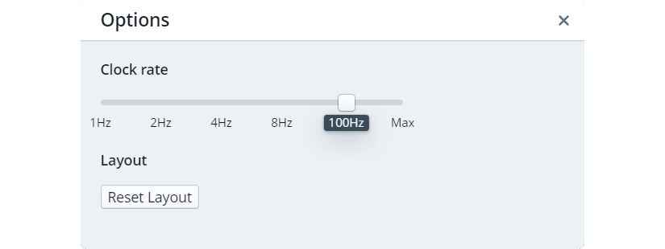

# IDE User Guide

The [RTeasy-Online IDE](../../..) has two different modes. On the one hand there is the editing mode, in which the program is developed. On the other hand there is the simulation mode, where you can execute the program and display the register, bus, register array and memory contents. In this mode, you cannot modify the program. In both modes all views can be moved around freely.

At the start you are always in the editing mode.

## Toolbar

At the top you can see the toolbar. With File and Edit classic IDE functions like loading/saving the file or undo/redo can be done. Under Run you can find the same functionality that is available in the second row in the center of the screen. The first button () builds the program and, if successful, takes you to the simulation mode. The remaining four are used to control the simulation and are disabled in edit mode.

---

## Options Dialog

The options dialog is accessible via the toolbar: `File -> Options...`.

Here you can set the clock rate for the simulation. Furthermore, it is possible to reset changes to the layout.

---

