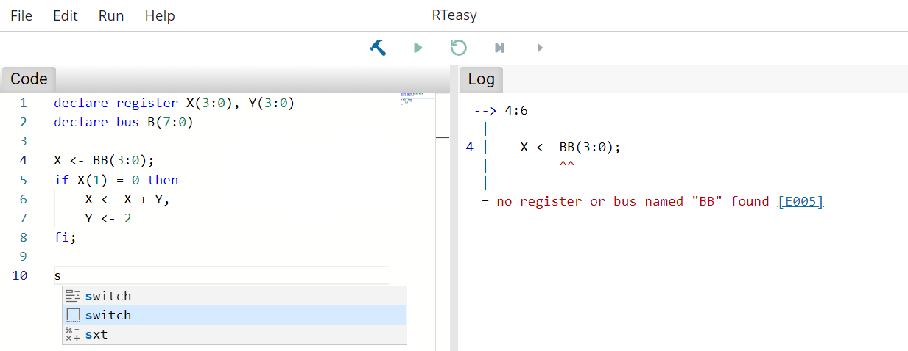

# Editing Mode

Besides syntax highlighting, the code editor supports autocompletion and code snippets for frequently used constructs like switch-case operations. At the same time, all errors, if any, are displayed live on the right side.

Each error is associated with an error code that can be clicked and leads to the [compiler error index](../../compiler-error-index/errors.md) that explains the errors in more detail.

---

