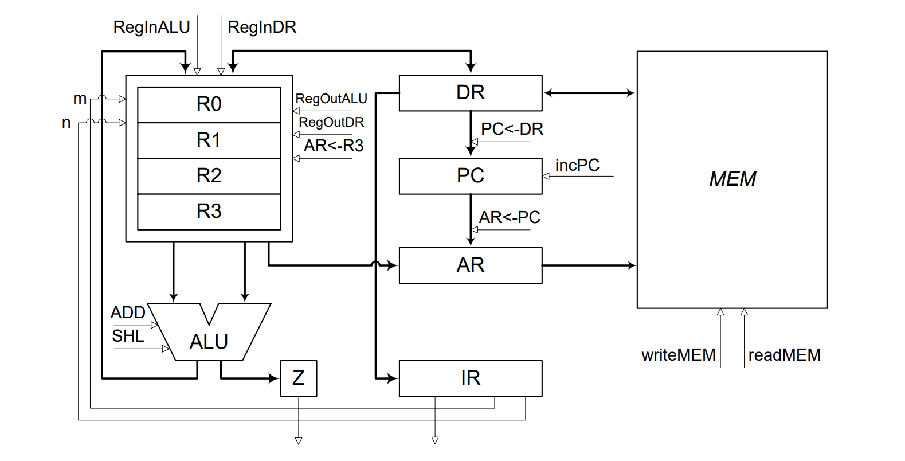

# Register-Register-Machine

## Task



Using the above block diagram, a simple processor is to be realized. For this a register array is to be used to manage the 8-bit source and destination registers. Via the shown data path instructions and data are loaded from the memory into the instruction register _IR_. The instruction format is given as follows:


Each instruction consists of at least one byte. For jump instructions a second byte with the destination address is needed. The source and destination registers of the register array _Rm_ and _Rn_ are specified via two 2-bit wide numbers. A 4 bit wide number encodes the instruction to be executed. The processor has the following instructions for unsigned numbers:

| Instruction    | Opcode | Description                                                                                               |
| -------------- | ------ | --------------------------------------------------------------------------------------------------------- |
| ADD _Rm_, _Rn_ | 0001   | Adds _Rm_ and _Rn_, result in _Rm_                                                                        |
| SHL _Rm_       | 0010   | Shifts _Rm_ by one bit to the left and sets the vacant bit to 0                                           |
| LOAD _Rm_      | 0011   | Loads _Rm_ with the memory contents specified by _R3_                                                     |
| STORE _Rm_     | 0100   | Writes _Rm_ to the memory location specified in _R3_                                                      |
| JMP address    | 0101   | Continues the program execution at _address_                                                              |
| BREQ address   | 0110   | Continues the program execution at _address_ if the result of the last result of the last operation was 0 |

The arithmetic logic unit (ALU) does not consider overflows, which means that in this case only the lower 8 bits of the result are output. To be able to execute the BREQ instruction more easily, the ALU has an additional flag _Z_, which takes the value value 1 if the result of the last operation was 0. Otherwise Z is set to 0.

## Draft Program

First you can see from the block diagram which registers, memories and register arrays are needed:

```rteasy
declare register IR(7:0), AR(7:0), DR(7:0), PC(7:0), Z
declare register array R(7:0)[4]
declare memory MEM(AR, DR)
```

Next, the registers that are read from at the beginning should be initialized with 0. Since one reads an instruction from the memory first, `PC` and `AR` should be initialized. This can be done under a label `INIT` for the sake of clarity:

```rteasy
~declare register IR(7:0), AR(7:0), DR(7:0), PC(7:0), Z
~declare register array R(7:0)[4]
~declare memory MEM(AR, DR)
~
INIT:
    PC <- 0, AR <- 0;
```

With the declaration and initialization completed, the first program step follows, the fetching of instructions from memory, whereby the incrementing of the program counter `PC` already prepares for the next instruction:

```rteasy
~declare register IR(7:0), AR(7:0), DR(7:0), PC(7:0), Z
~declare register array R(7:0)[4]
~declare memory MEM(AR, DR)
~
~INIT:
~    PC <- 0, AR <- 0;
~
FETCH:
    AR <- PC;
    PC <- PC + 1, read MEM;
```

Now the instruction must go into `IR`, where it is processed. For this purpose a switch case is used, which compares the upper 4 bits of the instruction stored in `IR` to the values 0 to 6 and jumps to the label where the respective instruction is executed in case of a match:

<!-- compile_fail(E006) since goto labels are not yet defined -->

```rteasy,compile_fail(E006)
~declare register IR(7:0), AR(7:0), DR(7:0), PC(7:0), Z
~declare register array R(7:0)[4]
~declare memory MEM(AR, DR)
~
~INIT:
~    PC <- 0, AR <- 0;
~
~FETCH:
~    AR <- PC;
~    PC <- PC + 1, read MEM;
~
    IR <- DR | switch IR(7:4) {
        case 0: goto FETCH
        case 1: goto ADD
        case 2: goto SHL
        case 3: goto LOAD
        case 4: goto STORE
        case 5: goto JMP
        case 6: goto BREQ
        default: goto END
    };
```

The instruction executions follow:

```rteasy
~declare register IR(7:0), AR(7:0), DR(7:0), PC(7:0), Z
~declare register array R(7:0)[4]
~declare memory MEM(AR, DR)
~
~INIT:
~    PC <- 0, AR <- 0;
~
~FETCH:
~    AR <- PC;
~    PC <- PC + 1, read MEM;
~
~    IR <- DR | switch IR(7:4) {
~        case 0: goto FETCH
~        case 1: goto ADD
~        case 2: goto SHL
~        case 3: goto LOAD
~        case 4: goto STORE
~        case 5: goto JMP
~        case 6: goto BREQ
~        default: goto END
~    };
~
ADD:
    # Add Rm and Rn and write the result into Rm
    R[IR(3:2)] <- R[IR(3:2)] + R[IR(1:0)];
    # If the result is 0, then set Z otherwise set Z to 0
    # and fetch the next instruction
    if R[IR(3:2)] = 0 then Z <- 1 else Z <- 0 fi, goto FETCH;

SHL:
    # Shift Rm by one bit to the left and set the vacant bit to 0
    R[IR(3:2)] <- R[IR(3:2)](6:0)."0";
    # If the result is 0, then set Z otherwise set Z to 0
    # and fetch the next instruction
    if R[IR(3:2)] = 0 then Z <- 1 else Z <- 0 fi, goto FETCH;

LOAD:
    # Write the content of R3 into the address register
    AR <- R[3];
    # Read from memory
    read MEM;
    # Store the memory contents in the register array and fetch the next instruction
    R[IR(3:2)] <- DR, goto FETCH;

STORE:
    # Write the content of R3 into the address register
    # and write Rm into the data register
    AR <- R[3], DR <- R[IR(3:2)];
    # Write the data into the memory and fetch the next instruction
    write MEM, goto FETCH;


JMP:
    # Get the jump address from the memory
    AR <- PC;
    read MEM;
    # Set PC to this address and fetch the next instruction
    PC <- DR | goto FETCH;

BREQ:
    # If Z is set then execute a jump (JMP),
    # otherwise continue in the program as usual (fetch the next instruction)
    if Z = 1 then goto JMP else goto FETCH fi;

END:
    # If undefined instructions occur, the program ends here
    nop;
```

The complete program should now look something like this:

```rteasy
declare register IR(7:0), AR(7:0), DR(7:0), PC(7:0), Z
declare register array R(7:0)[4]
declare memory MEM(AR, DR)

INIT:
    PC <- 0, AR <- 0;

FETCH:
    AR <- PC;
    PC <- PC + 1, read MEM;

    IR <- DR | switch IR(7:4) {
        case 0: goto FETCH
        case 1: goto ADD
        case 2: goto SHL
        case 3: goto LOAD
        case 4: goto STORE
        case 5: goto JMP
        case 6: goto BREQ
        default: goto END
    };

ADD:
    # Add Rm and Rn and write the result into Rm
    R[IR(3:2)] <- R[IR(3:2)] + R[IR(1:0)];
    # If the result is 0, then set Z otherwise set Z to 0
    # and fetch the next instruction
    if R[IR(3:2)] = 0 then Z <- 1 else Z <- 0 fi, goto FETCH;

SHL:
    # Shift Rm by one bit to the left and set the vacant bit to 0
    R[IR(3:2)] <- R[IR(3:2)](6:0)."0";
    # If the result is 0, then set Z otherwise set Z to 0
    # and fetch the next instruction
    if R[IR(3:2)] = 0 then Z <- 1 else Z <- 0 fi, goto FETCH;

LOAD:
    # Write the content of R3 into the address register
    AR <- R[3];
    # Read from memory
    read MEM;
    # Store the memory contents in the register array and fetch the next instruction
    R[IR(3:2)] <- DR, goto FETCH;

STORE:
    # Write the content of R3 into the address register
    # and write Rm into the data register
    AR <- R[3], DR <- R[IR(3:2)];
    # Write the data into the memory and fetch the next instruction
    write MEM, goto FETCH;


JMP:
    # Write the content of PC into the address register
    AR <- PC;
    # Get the jump address from the memory
    read MEM;
    # Set PC to this address and fetch the next instruction
    PC <- DR | goto FETCH;

BREQ:
    # If Z is set then execute a jump (JMP),
    # otherwise continue in the program as usual (fetch the next instruction)
    if Z = 1 then goto JMP else goto FETCH fi;

END:
    # If undefined instructions occur, the program ends here
    nop;
```

## Simulation

To simulate the program, a memory content containing the instructions is necessary. For this you can download [this memory file](../../files/rrm-memory.rtmem) (same as below). Then load it into `MEM` as shown [here](../ide/simulation-mode.md#register-array-and-memory-view).

```rtmem
{{#include ../../files/rrm-memory.rtmem}}
```

After you have set up the memory, you can start simulating the program. The table below shows what effect the memory content should have.

| Address | Description                                                                    | Rm       | Rn       |
| ------- | ------------------------------------------------------------------------------ | -------- | -------- |
| 0       | Load the value at address `R3` (= 0) into register array at position _m_ (= 0) | 00110000 | x        |
| 1       | Add register at position _m_ (= 1) and at position _n_ (= 0)                   | 00110000 | 00110000 |
| 2       | Shift register at position _m_ (= 1) by 1 bit to the left                      | 01100000 | x        |
| 3       | Write the value from register _m_ (= 2) to the memory at address `R3`          | x        | x        |
| 4       | Jump to value from next address                                                | x        | x        |
| 5       | Address to jump to                                                             | x        | x        |
| 6       | (should not be reached!) If `Z=1` jump to value from next address              | x        | x        |
| 7       | Address to jump to                                                             | x        | x        |
