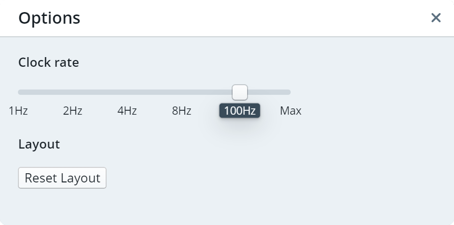

# IDE User Guide

The [RTeasy-Online IDE](../../..) has two different modes. On the one hand there is the editing mode, in which the program is developed. On the other hand there is the simulation mode, where you can execute the program and display the register, bus, register array and memory contents. In this mode, you cannot modify the program. In both modes all views can be moved around freely.

At the start you are always in the editing mode.

## Options Dialog

The options dialog is accessible via the toolbar: `File -> Options...`.

Here you can set the clock rate for the simulation. Furthermore, it is possible to reset changes to the layout.

---

