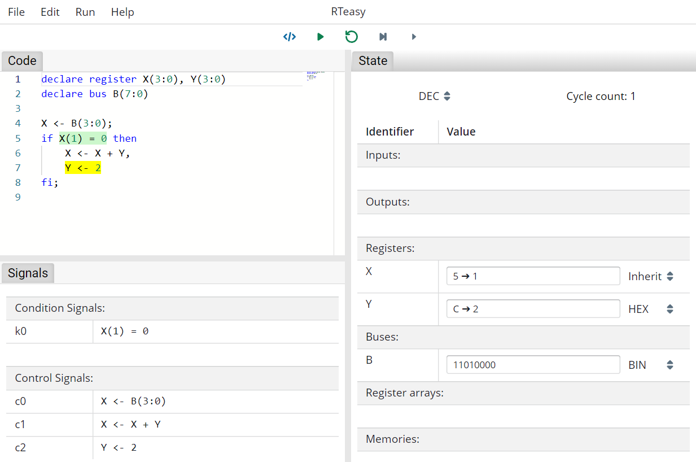
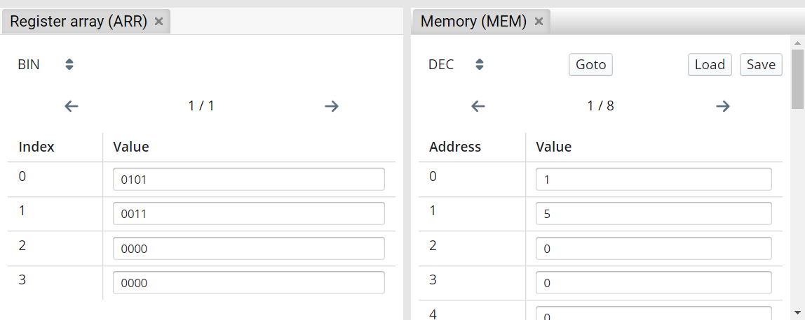

# Simulation Mode

This mode is for the simulating and testing the program. In addition to the code, the signals and the current state can be viewed here.
The state view displays the register, bus, register array and memory contents. During simulation, both the code and the state view provide visual hints.

The buttons at the top center are now all operable. From left to right they let you return to the editing mode (), start/stop the simulation (/), reset the simulation (), make a step (execute the next state) () and make a micro step (execute the next micro step) ().

---

## Code View

During simulation, the code view provide visual hints.
When executing a micro step, the current micro step is highlighted in yellow. Conditions are highlighted either green or red, respectively, whether they evaluate to true or false. For conditions, this highlighting becomes transparent as soon as the next micro operation is executed.
When executing a step, the complete current step is highlighted in yellow.

## State View

The state view displays the register, bus, register array and memory contents. In addition, the cycle count is displayed in the upper right corner.

Via several dropdowns it is possible to select the base in which the values are presented. The dropdown in the upper left corner serves as the global default setting. This setting can then be inherited elsewhere (Inherit) or overwritten locally (BIN/DEC/HEX).

During simulation, the state view provide visual hints.
When executing with micro steps, writes to registers are represented by an arrow, with the value that is assigned after the clock cycle on the right-hand side.
After executing a complete step, values that have changed are highlighted in yellow.

### Register Array and Memory View

Register array and memory views are not shown by default and can be opened by clicking the _Content_ button next to their name in the state view.

Both allow you to set a base in which the values are presented. The content is divided over several pages.
For memories it is possible to jump to a specific address via _Goto_. You can load a memory state or save the current state via _Load_ and _Save_.

---

## Signals View

The signals view shows the condition signals and control signals of a resulting execution unit and control unit respectively.

## Breakpoints

By clicking on the line numbers it is possible to set or remove breakpoints. If the simulation is now started via the play button, it will pause as soon as a breakpoint is reached.

TODO: Image
