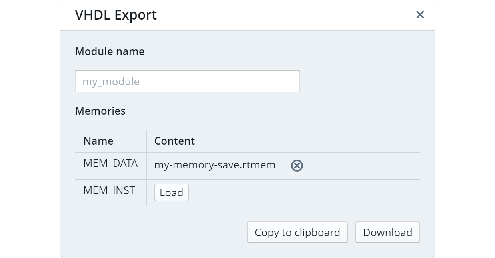

# VHDL Export

The VHDL export is accessible via the toolbar: `File -> Export to VHDL...`.

If your code does not contain any errors you should see a dialog like below. Note: Some errors occur only during VHDL export. So you might see errors even though you can simulate your code without problems.

---

## Module name

Choose a module name for the export. The generated VHDL code will contain the entities `CU_my_module` (control unit) and `EU_my_module` (execution unit). If not specified, `my_module` will be used.

## Memories

For each memory in your code you can select a memory file with which this memory is pre-initialized. The size of the address and data register must match exactly.
